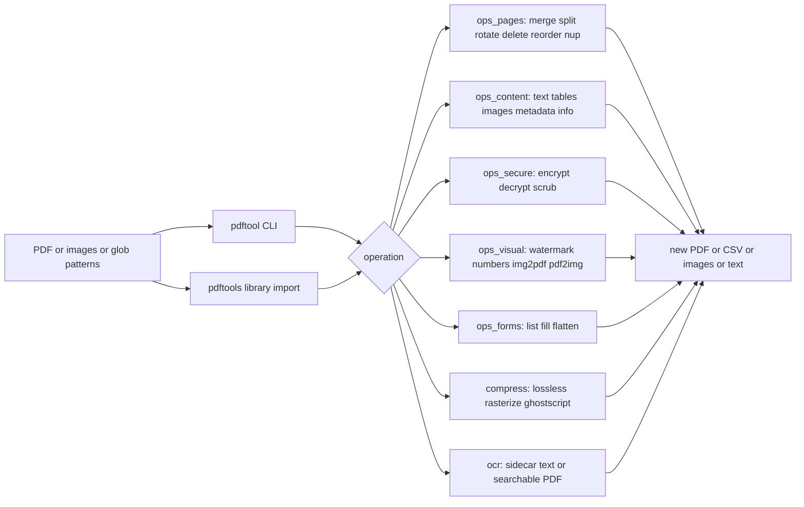
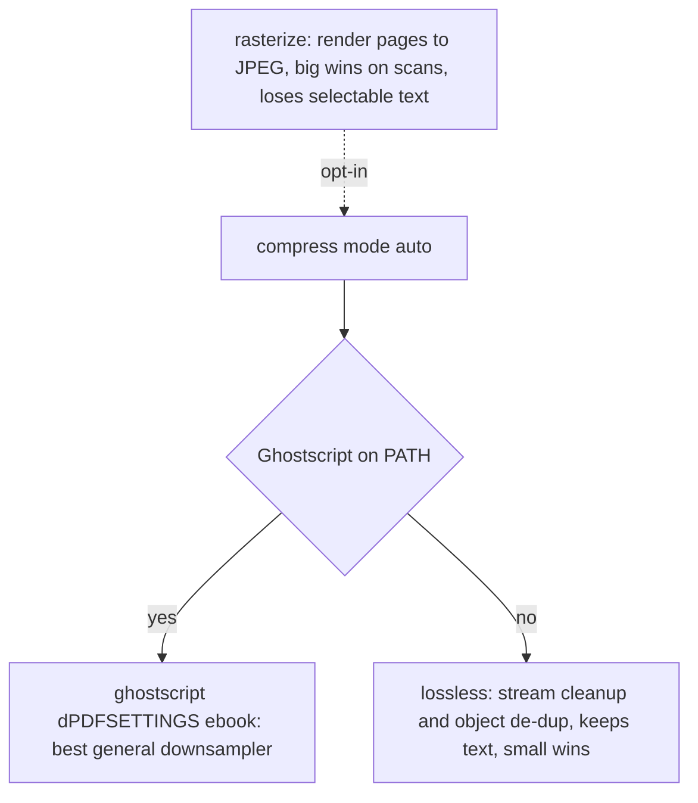

# pdf-power-tools

**One CLI and one Python library for everything PDF** — merge, split, compress, watermark, encrypt, extract text/tables/images, fill forms, and OCR. No cloud, no upload, no per-document fees.


---

## Why

Every "PDF toolkit" I have needed sat behind one of three walls: a web uploader that wants your confidential contract on someone else's server, a €120 desktop app, or a pile of half-remembered one-liners glued to five different libraries (`pypdf` for merging, `pdfplumber` for tables, `pypdfium2` for rendering, `reportlab` for stamping, `pytesseract` for OCR). Each has a different API, a different idea of what a "page range" is, and a different failure mode.

`pdf-power-tools` is the glue, done once and tested. One consistent page-range grammar (`1-3,7,9-`), one `-o` output convention, glob inputs everywhere, `--dry-run` on the destructive commands, and every function returns the path it wrote so calls compose. It is **honest about trade-offs** — the compressor tells you when it is about to throw away your selectable text, and points you at `qpdf`/`ocrmypdf`/Ghostscript when those are genuinely the better tool.

Everything runs on your machine. The only optional external piece is the Tesseract binary, and only if you use `ocr`.

## Architecture



Each operation module owns exactly one backend so the dependencies stay legible:

| Module | Backend | Does |
| --- | --- | --- |
| `ops_pages` | pypdf | merge, split, rotate, delete, reorder, 2/4-up |
| `ops_content` | pypdf + pdfplumber | text, tables, images, metadata, info |
| `ops_secure` | pypdf | AES-256 encrypt/decrypt, metadata scrub |
| `ops_visual` | reportlab + Pillow + pypdfium2 | watermark, page numbers, image conversion |
| `ops_forms` | pypdf | inspect, fill, flatten AcroForms |
| `compress` | pypdf + pypdfium2 + Ghostscript | three explicit compression strategies |
| `ocr` | pytesseract + pypdfium2 | sidecar text or searchable PDF |

## Quickstart

```bash
git clone https://github.com/AleBrito124356/pdf-power-tools.git
cd pdf-power-tools

python -m venv .venv
source .venv/bin/activate        # Windows: .venv\Scripts\activate

pip install -e .                 # installs the `pdftool` command
# or, just the deps:  pip install -r requirements.txt

# Optional config (only if Tesseract is not on your PATH):
cp .env.example .env             # then edit TESSERACT_CMD

pdftool doctor                   # report which optional pieces are available
```

There are **no API keys** to obtain — this tool talks to no network service. The only optional dependency is the Tesseract OCR engine (a native install, not a pip package); `pdftool doctor` and `.env.example` walk you through it. Everything else is pure Python and installs from PyPI.

## Cookbook

Seventeen common jobs, most a single command. `<in>` is your input PDF.

| I want to... | Command |
| --- | --- |
| Merge several scans into one file | `pdftool merge scan1.pdf scan2.pdf "inbox/*.pdf" -o all.pdf` |
| Add page numbers, skipping the cover | `pdftool numbers all.pdf -o numbered.pdf --format "{n}/{total}" --skip-first` |
| Merge scans **and** number them | `pdftool merge "s*.pdf" -o m.pdf && pdftool numbers m.pdf -o out.pdf` |
| Split a report into per-chapter files | `pdftool split report.pdf --by-bookmark -o chapters/` |
| Keep only pages 1-3 and 7 | `pdftool split <in> --ranges "1-3,7" -o parts/` |
| Get CSVs from bank-statement tables | `pdftool tables statement.pdf -o tables/ --format csv` |
| Pull plain text for search or RAG | `pdftool text <in> -o notes.txt --layout` |
| Redact metadata before sharing | `pdftool scrub <in> -o clean.pdf --flatten-annotations` |
| Password-protect a contract | `pdftool encrypt <in> -o locked.pdf --user-password "CHANGE_ME_32_CHARS"` |
| Remove a password you know | `pdftool decrypt locked.pdf -o open.pdf --password "CHANGE_ME_32_CHARS"` |
| Stamp a tiled DRAFT watermark | `pdftool watermark <in> -o draft.pdf --text DRAFT --tiled --opacity 0.12` |
| Stamp a logo bottom-right | `pdftool watermark <in> -o branded.pdf --image logo.png --position bottom-right` |
| Shrink a bloated scanned PDF | `pdftool compress <in> -o small.pdf --mode rasterize --dpi 150` |
| Turn a folder of photos into a PDF | `pdftool img2pdf "photos/*.jpg" -o album.pdf --page-size a4 --fit contain` |
| Export pages to 300-dpi PNGs | `pdftool pdf2img <in> -o pages/ --dpi 300` |
| Fill a form from JSON and flatten it | `pdftool fill form.pdf data.json -o filled.pdf --flatten` |
| OCR a scan into a searchable PDF | `pdftool ocr scanned.pdf -o searchable.pdf --mode pdf --lang eng` |

Add `--dry-run` before any destructive command to see the plan without writing files.

## Library usage

The CLI is a thin shell over the library. Every op is importable, works on paths, and returns the output path so you can chain.

```python
from pdftools import (
    merge, split, extract_text, extract_tables,
    watermark, page_numbers, encrypt, compress, fill,
)

# Merge a glob, then number every page but the cover.
merge(["invoices/*.pdf"], "merged.pdf")
page_numbers("merged.pdf", "final.pdf", fmt="Page {n} of {total}", skip_first=True)

# Bank statement -> one CSV per detected table.
tables = extract_tables("statement.pdf", "out/", fmt="csv")
print(f"found {len(tables)} tables")

# Layout-preserving text (good for columns and forms).
text = extract_text("report.pdf", layout=True)

# Watermark, then lock with AES-256. Owner password differs from the
# user password, so the file opens freely but resists editing.
watermark("report.pdf", "draft.pdf", text="CONFIDENTIAL", tiled=True, opacity=0.1)
encrypt(
    "draft.pdf", "locked.pdf",
    user_password="",                    # opens without a prompt
    owner_password="CHANGE_ME_32_CHARS", # required to edit or print
)

# Honest compression: rasterize wins big on scans but drops selectable text.
compress("scanned.pdf", "smaller.pdf", mode="rasterize", dpi=150, jpeg_quality=60)

# Fill a form from a dict and flatten it into a static document.
fill("form.pdf", "filled.pdf", {"full_name": "Ada Lovelace"}, flatten=True)
```

### Page-range grammar

The same spec is accepted by `split --ranges`, `rotate --pages`, `delete --pages`, `reorder --order`, and the `pages=` argument everywhere:

- `5` — a single page (1-based)
- `2-6` — an inclusive range, `6-2` counts down
- `9-` — page 9 to the end, `-3` from the start to page 3
- `N` — the last page
- `1-3,7,9-` — comma-separate as many groups as you like

## Compression, honestly

There is no lossless "make it 10x smaller" button. `compress` exposes three real strategies and picks a safe default:



- **`lossless`** recompresses content streams and removes duplicate objects. Safe, keeps everything, typically 5-20% smaller.
- **`rasterize`** renders each page to a JPEG and rebuilds. Big wins on scanned or image-heavy files, but the output is images — selectable text is gone. You opt in explicitly.
- **`ghostscript`** shells out to Ghostscript's `-dPDFSETTINGS` pipeline when it is installed. Best all-round result; detected automatically in `auto` mode, never required.

## When to reach for something else

This tool is deliberately a good generalist, not a specialist. Use the right tool when it matters:

- **[qpdf](https://github.com/qpdf/qpdf)** — the reference for linearization, structural repair, and fast encryption in C++. If you need a rock-solid `--decrypt`/`--linearize` in a pipeline, use qpdf.
- **[OCRmyPDF](https://github.com/ocrmypdf/OCRmyPDF)** — a far more complete OCR pipeline (deskew, clean, sidecar, optimize). `pdftool ocr` covers the common case; OCRmyPDF covers the hard one.
- **[Ghostscript](https://www.ghostscript.com/)** — the gold standard for compression and PDF/A. `pdftool compress` will happily call it for you.
- **[pdfcpu](https://github.com/pdfcpu/pdfcpu)** — a single fast Go binary for imposition and validation with zero Python.

The value here is having all of the everyday jobs behind one consistent interface with tests, not beating the specialists at their own game.

## Project structure

```
pdf-power-tools/
├── src/pdftools/
│   ├── __init__.py        # flat public API: merge, split, extract_text, ...
│   ├── cli.py             # argparse subcommands -> the `pdftool` command
│   ├── _util.py           # page-range grammar, glob expansion, colour parsing
│   ├── ops_pages.py       # merge, split, rotate, delete, reorder, n_up
│   ├── ops_content.py     # text, tables, images, metadata, info
│   ├── ops_secure.py      # encrypt, decrypt, strip_metadata
│   ├── ops_visual.py      # watermark, page_numbers, images_to_pdf, pdf_to_images
│   ├── ops_forms.py       # list_fields, fill, flatten
│   ├── compress.py        # lossless / rasterize / ghostscript
│   └── ocr.py             # sidecar text or searchable PDF
├── tests/
│   ├── conftest.py        # builds ALL fixtures with reportlab (ships no binary PDFs)
│   └── test_*.py          # round-trip tests for every op
├── pyproject.toml         # console_script: pdftool = pdftools.cli:main
├── requirements.txt
├── .env.example
└── LICENSE
```

## Development

```bash
pip install -e ".[dev]"
pytest                     # 45 tests, ~1s, no network, no binary fixtures
```

The test suite is self-contained: `conftest.py` generates every PDF it needs with reportlab — a 5-page document, one with an embedded image, a ruled-table page, an AcroForm, a bookmarked file, and an encrypted file — so nothing binary is committed and every op is tested round-trip. The OCR tests skip cleanly when Tesseract is not installed.

## Related projects

Part of a family of practical, self-hostable developer tools:

- **[python-automation-toolbox](https://github.com/AleBrito124356/python-automation-toolbox)** — 20 standalone Python automation scripts for real life: file organizing, dedupe, batch images, backups, QR codes. The grab-bag companion to this focused PDF tool.
- **[structured-extraction-agents](https://github.com/AleBrito124356/structured-extraction-agents)** — turn the messy text and tables you pull out here into validated JSON with Pydantic schemas and self-repair loops.
- **[telegram-ai-agents](https://github.com/AleBrito124356/telegram-ai-agents)** — three complete Telegram bots, including a talk-to-your-PDFs RAG bot that pairs naturally with `pdftool text`.
- **[rag-blueprints](https://github.com/AleBrito124356/rag-blueprints)** — 8 RAG architectures on free NVIDIA NIM endpoints; feed them the text this tool extracts.

## License

MIT © 2026 Alejandro Brito. See [LICENSE](LICENSE).
