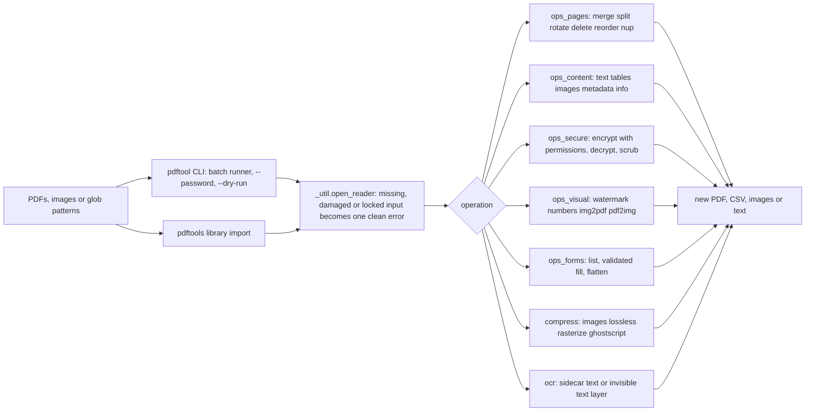
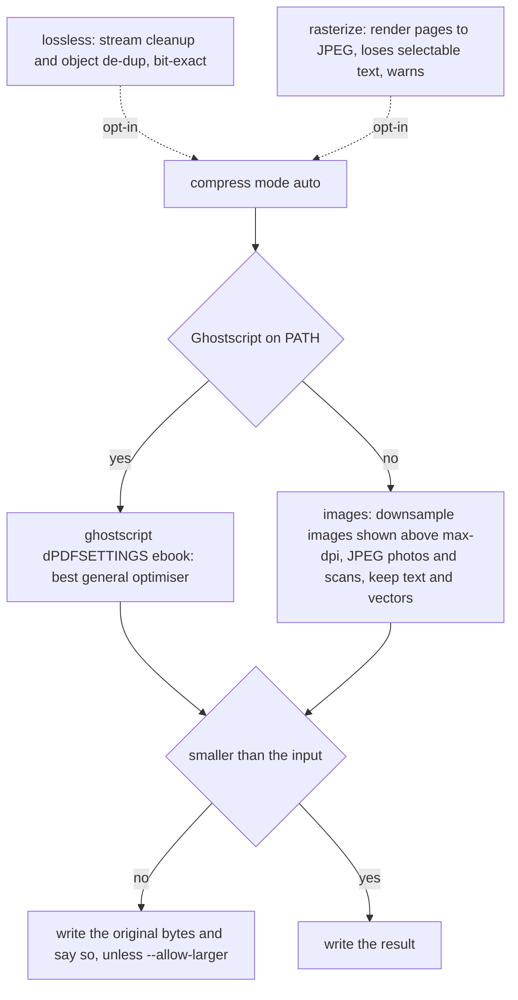

# pdf-power-tools

**One CLI and one Python library for everything PDF**: merge, split, compress, watermark, encrypt, extract text/tables/images, fill forms, and OCR. No cloud, no upload, no per-document fees.


---

## Why

Every "PDF toolkit" I have needed sat behind one of three walls: a web uploader that wants your confidential contract on someone else's server, a €120 desktop app, or a pile of half-remembered one-liners glued to five different libraries (`pypdf` for merging, `pdfplumber` for tables, `pypdfium2` for rendering, `reportlab` for stamping, `pytesseract` for OCR). Each has a different API, a different idea of what a "page range" is, and a different failure mode.

`pdf-power-tools` is the glue, done once and tested. It gives you:

- one page-range grammar (`1-3,7,9-`) and one `-o` output convention;
- glob inputs on every command, with several files processed as a batch;
- `--dry-run` on every command that writes files;
- `--password` for encrypted inputs on every command that reads a PDF;
- one-line error messages instead of library tracebacks;
- library functions that return the path they wrote, so calls compose.

Merging, rotating, decrypting and scrubbing keep form fields, links and bookmarks. The tool is **honest about trade-offs**. Compression keeps selectable text unless you ask otherwise, it warns before a mode throws text away, and it never hands you a bigger file. It points you at `qpdf`, `ocrmypdf` or Ghostscript when those are genuinely the better tool.

Everything runs on your machine. The only optional external pieces are the Tesseract binary (only for `ocr`) and Ghostscript (only as a compression booster).

## Architecture



Each operation module owns one backend, so the dependencies stay easy to follow:

| Module | Backend | Does |
| --- | --- | --- |
| `_util` | pypdf, pypdfium2, pdfplumber | opens inputs safely (passwords, damaged files), page ranges, globs |
| `ops_pages` | pypdf | merge, split, rotate, delete, reorder, 2/4-up, keeping forms and bookmarks |
| `ops_content` | pypdf + pdfplumber + pypdfium2 | text, tables, images, metadata, `info` with an OCR hint |
| `ops_secure` | pypdf | AES-256 encrypt with real permission flags, decrypt, metadata scrub |
| `ops_visual` | reportlab + Pillow + pypdfium2 | rotation-aware watermark and page numbers, EXIF/DPI-aware image conversion |
| `ops_forms` | pypdf | inspect, validated fill, flatten AcroForms |
| `compress` | pypdf + pypdfium2 + Pillow (+ Ghostscript) | four explicit compression strategies with a never-larger guard |
| `ocr` | pytesseract + pypdfium2 + reportlab | sidecar text, or an invisible text layer over the original pages |

## Quickstart

```bash
git clone https://github.com/AleBrito124356/pdf-power-tools.git
cd pdf-power-tools

python -m venv .venv
source .venv/bin/activate        # Windows: .venv\Scripts\activate

pip install -e .                 # installs the `pdftool` command
# or, just the deps:  pip install -r requirements.txt

# Optional config, only if Tesseract is installed but NOT on your PATH:
cp .env.example .env             # then uncomment and edit TESSERACT_CMD

pdftool doctor                   # report which optional pieces are available
```

There are **no API keys** to obtain, because this tool talks to no network service. The only optional dependency that pip cannot install is the Tesseract OCR engine (a native program); `pdftool doctor` and `.env.example` walk you through it. Everything else is pure Python and installs from PyPI.

## Cookbook

Common jobs, most of them one command. `<in>` is your input PDF, and every `<in>` can also be a glob or a list of files.

| I want to... | Command |
| --- | --- |
| Merge several scans into one file (scan2 before scan10) | `pdftool merge scan1.pdf scan2.pdf "inbox/*.pdf" -o all.pdf` |
| Add page numbers, skipping the cover | `pdftool numbers all.pdf -o numbered.pdf --format "{n}/{total}" --skip-first` |
| Merge scans **and** number them | `pdftool merge "s*.pdf" -o m.pdf && pdftool numbers m.pdf -o out.pdf` |
| Split a report into per-chapter files | `pdftool split report.pdf --by-bookmark -o chapters/` |
| Keep only pages 1-3 and 7, in one file | `pdftool reorder <in> --order "1-3,7" -o excerpt.pdf` |
| Get CSVs from bank-statement tables | `pdftool tables statement.pdf -o tables/ --format csv` |
| Pull plain text for search or RAG | `pdftool text <in> -o notes.txt --layout` |
| Check which pages need OCR | `pdftool info <in>` (look at `pages_without_text`) |
| Redact metadata before sharing | `pdftool scrub <in> -o clean.pdf --flatten-annotations` |
| Password-protect a contract | `pdftool encrypt <in> -o locked.pdf --user-password "CHANGE_ME_32_CHARS"` |
| Open freely, but block editing and copying | `pdftool encrypt <in> -o locked.pdf --owner-password "CHANGE_ME_32_CHARS"` |
| Allow printing and form filling only | `pdftool encrypt <in> -o form.pdf --owner-password "CHANGE_ME_32_CHARS" --allow print,fill-forms` |
| Remove a password you know | `pdftool decrypt locked.pdf -o open.pdf --password "CHANGE_ME_32_CHARS"` |
| Work on a locked file directly | `pdftool text locked.pdf --password "CHANGE_ME_32_CHARS"` |
| Stamp a tiled DRAFT watermark | `pdftool watermark <in> -o draft.pdf --text DRAFT --tiled --opacity 0.12` |
| Stamp a logo bottom-right | `pdftool watermark <in> -o branded.pdf --image logo.png --position bottom-right` |
| Shrink a scanned or photo-heavy PDF, keeping its text | `pdftool compress <in> -o small.pdf` (auto: Ghostscript, else `--mode images`) |
| Shrink harder by downsampling images to 100 dpi | `pdftool compress <in> -o small.pdf --mode images --max-dpi 100` |
| Compress every PDF in a folder | `pdftool compress "invoices/*.pdf" -o compressed/` |
| Watermark every PDF in a folder | `pdftool watermark "contracts/*.pdf" --text CONFIDENTIAL -o stamped/` |
| Turn phone photos into a PDF (upright, A4, margins) | `pdftool img2pdf "photos/*.jpg" -o album.pdf --page-size a4 --margin 36` |
| Export pages to 300-dpi PNGs | `pdftool pdf2img <in> -o pages/ --dpi 300` |
| Fill a form from JSON and flatten it | `pdftool fill form.pdf data.json -o filled.pdf --flatten` |
| Fail loudly on typos in the form data | `pdftool fill form.pdf data.json -o filled.pdf --strict` |
| OCR a scan into a searchable PDF | `pdftool ocr scanned.pdf -o searchable.pdf --mode pdf --lang eng` |
| OCR every page, even ones with text | `pdftool ocr mixed.pdf -o all.txt --force` |

Add `--dry-run` to any command that writes files to see the plan without writing anything. It works before or after the subcommand, like `--password`, `-q` and `--debug`.

### Batch mode

Every single-input command (`compress`, `watermark`, `numbers`, `rotate`, `delete`, `reorder`, `nup`, `encrypt`, `decrypt`, `scrub`, `meta`, `fill`, `ocr`, `text`, `tables`, `images`, `pdf2img`, `split`, `info` and `fields`) accepts several paths or a glob:

```bash
pdftool compress "scans/*.pdf" -o small/           # small/<name>.compressed.pdf for each match
pdftool --dry-run numbers "reports/*.pdf" -o out/  # list every planned output, write nothing
pdftool watermark a.pdf b.pdf --text DRAFT         # no -o: a.watermarked.pdf beside each source
pdftool split "books/*.pdf" --every 10 -o parts/   # parts/<name>/<name>_part01.pdf ...
pdftool info "inbox/*.pdf"                         # one JSON object per line
```

- With several inputs, `-o` is a directory. It is created if it is missing, and outputs are named `<stem>.<suffix>.pdf` inside it. Commands that write many files (`split`, `images`, `pdf2img`, `tables`) get one sub-folder per input.
- Two inputs with the same file name from different folders get distinct outputs (`doc.rotated.pdf`, `doc-2.rotated.pdf`).
- If one file fails (damaged, locked, wrong password), the batch reports `error: <file>: <reason>` and carries on. It ends with an `N ok, M failed` line and exits with code 2.
- A single literal path behaves exactly as before: `-o` names the output file.

### Exit codes and errors

| Code | Meaning |
| --- | --- |
| `0` | success |
| `2` | a problem with the input or options, such as a missing, damaged or locked file, a wrong password, a bad `--format` template, an unreadable image, form data that `--strict` rejects, or at least one failed file in a batch |
| `1` | an unexpected internal error, reported in one line. Re-run with `--debug` for the full traceback |
| `130` | interrupted |

Library warnings (a form key that matches no field, a compression mode that drops text, permissions without an owner password) print as `warning: ...` lines on stderr.

## Library usage

The CLI is a thin shell over the library. Every operation can be imported, works on paths, and returns the output path, so you can chain calls. Every function that reads a PDF accepts `password=`.

```python
import warnings
from pdftools import (
    merge, split, extract_text, extract_tables, watermark, page_numbers,
    encrypt, compress_with_stats, fill, info, ocr_with_stats, PdfToolsWarning,
)

# Merge a glob (natural order), then number every page but the cover.
# Form fields and each source's bookmarks survive the merge.
merge(["invoices/*.pdf"], "merged.pdf")
page_numbers("merged.pdf", "final.pdf", fmt="Page {n} of {total}", skip_first=True)

# Bank statement -> one CSV per detected table.
tables = extract_tables("statement.pdf", "out/", fmt="csv")
print(f"found {len(tables)} tables")

# Layout-preserving text (good for columns and forms), from a locked file.
text = extract_text("report.pdf", layout=True, password="open-sesame")

# Watermark, then lock with AES-256. Because the owner password differs from
# the (empty) user password, the file opens and prints freely, but editing,
# copying, annotating and page assembly need the owner password.
watermark("report.pdf", "draft.pdf", text="CONFIDENTIAL", tiled=True, opacity=0.1)
encrypt(
    "draft.pdf", "locked.pdf",
    user_password="",                     # opens without a prompt
    owner_password="CHANGE_ME_32_CHARS",  # lifts the restrictions
    permissions=["print", "print-hq", "accessibility"],  # also the default here
)
print(info("locked.pdf")["encryption"])
# {'algorithm': 'AES-256', 'revision': 6, 'permissions': ['print', 'accessibility', 'print-hq']}

# Honest compression: shrink the embedded images, keep text and vectors.
result = compress_with_stats("scanned.pdf", "smaller.pdf", mode="images", max_dpi=150)
print(result.mode, result.bytes_before, "->", result.bytes_after,
      f"{result.images_recompressed}/{result.images_seen} images",
      "(kept original)" if result.kept_original else "")

# Fill a form from a dict. Checkboxes take True/False; typos raise with strict=True.
fill("form.pdf", "filled.pdf", {"full_name": "Ada Lovelace", "subscribe": True}, strict=True)

# Searchable PDF: pages that already have text are skipped.
ocr_result = ocr_with_stats("mixed.pdf", "searchable.pdf", mode="pdf")
print("OCR'd pages", ocr_result.pages_ocred, "skipped", ocr_result.pages_skipped)

# Warnings are ordinary Python warnings; escalate them if you prefer.
warnings.simplefilter("error", PdfToolsWarning)
```

### Page-range grammar

The same spec is accepted by `split --ranges`, `rotate --pages`, `delete --pages`, `reorder --order`, and the `pages=` argument everywhere:

- `5`: a single page (1-based)
- `2-6`: an inclusive range; `6-2` counts down
- `9-`: page 9 to the end; `-3`: from the start to page 3
- `N`: the last page
- `1-3,7,9-`: separate as many groups as you like with commas

`split --ranges "1-3,7"` writes **one file per group**. To keep several groups in a single file, use `reorder --order "1-3,7"`.

## Compression, honestly

There is no lossless "make it 10x smaller" button. In scanned and photo-heavy files, the bytes live in the embedded images, so that is where `compress` works:



- **`images`** (the default without Ghostscript) finds each embedded image and works out the DPI it is actually displayed at on the page. Images shown above `--max-dpi` (default 150) are downsampled. Photographic and scanned images are re-encoded as JPEG (`--jpeg-quality`, default 70). Flat artwork, charts and UI screenshots stay lossless, and masked, 1-bit, indexed, CMYK and tiny images are left alone. An image is only replaced when the new encoding is smaller. Text, fonts, vectors, links, forms and bookmarks are not touched.
- **`lossless`** recompresses content streams and removes duplicate objects. It is safe and bit-exact, but it only helps files that were written badly.
- **`rasterize`** renders each page to a JPEG. It can win on pure scans, but the output is pictures: selectable text, links and forms are gone, and the command prints a warning.
- **`ghostscript`** runs Ghostscript's `-dPDFSETTINGS` pipeline when it is installed. `auto` picks it when it is on your PATH, but it is never required.

Whatever the mode, **the output is never larger than the input**. If a strategy does not shrink the file, the original bytes are written and the report says so. Pass `--allow-larger` (`allow_larger=True`) to write the result anyway.

Measured on this machine without Ghostscript (`pdftool compress <in> --mode <mode>`):

| Input | `lossless` | `images` (default) | `rasterize` |
| --- | --- | --- | --- |
| 3-page letter scanned at 300 dpi greyscale, stored losslessly (9.6 MB) | 0% smaller | **80 KB, 99% smaller**, pages 1275×1650 px | 85 KB, 99% smaller |
| 2 pages, each with a 1600×1200 lossless photo and a text line (9.5 MB) | 0% | **182 KB, 98% smaller, text still selectable** | 184 KB, **text lost** |
| 3 pages of 2400×1800 synthetic noise "photos" (worst case, 9.3 MB) | 0% | 1.6 MB, 82% smaller, text still selectable | 276 KB, **text lost** |
| 5-page text-only report (3.8 KB) | 11% | 11% | would be 3524% *larger*, so the original is kept |

## OCR that keeps your document

`pdftool ocr` renders each page with pdfium and sends it to Tesseract at the real render DPI.

- **`--mode sidecar`** writes a `.txt` file with one page per form-feed.
- **`--mode pdf`** asks Tesseract only for word boxes. It maps them back into each page's coordinate space, taking account of the crop box and `/Rotate`. Then it lays an **invisible text layer over the original page**. The page size, vector art, existing text, bookmarks, forms and metadata stay exactly as they were. The page renders pixel-for-pixel the same, but you can now select and search it.
- Pages that already have selectable text are **skipped** and are not sent to Tesseract. In sidecar mode, their existing text is used. `--force` (`skip_text=False`) OCRs every page.

The invisible layer uses a standard Latin (WinAnsi) font. Characters outside it, such as Cyrillic, CJK or Arabic, become `?` in the text layer. For those scripts, or for deskewing and cleaning, use OCRmyPDF.

## Forms

`pdftool fields form.pdf` lists each field with its type and value; `--json` adds the choice options and the checkbox/radio states. `fill` validates the data against the form before writing:

- checkboxes accept `true`/`false`, `yes`/`no`, `on`/`off` or `1`/`0`, and are switched to the field's real on-state (`/Yes`, `/On`, or whatever the form's author named it);
- radio groups take the export value of the button to select;
- choice fields are checked against their options (case-insensitive). Editable combo boxes accept free text;
- a key that matches no field prints `warning: no form field named 'emial' (did you mean 'email'?)`. With `--strict`, it exits 2 and nothing is written.

## When to reach for something else

This tool is deliberately a good generalist, not a specialist. Use the right tool when it matters:

- **[qpdf](https://github.com/qpdf/qpdf)**: the reference for linearization, structural repair, and fast encryption in C++. If you need a rock-solid `--decrypt`/`--linearize` in a pipeline, use qpdf.
- **[OCRmyPDF](https://github.com/ocrmypdf/OCRmyPDF)**: a far more complete OCR pipeline (deskew, clean, PDF/A, every script). `pdftool ocr` covers the common case; OCRmyPDF covers the hard one.
- **[Ghostscript](https://www.ghostscript.com/)**: the gold standard for compression and PDF/A. `pdftool compress` calls it for you when it is installed.
- **[pdfcpu](https://github.com/pdfcpu/pdfcpu)**: a single fast Go binary for imposition and validation, with zero Python.

The value here is having all of the everyday jobs behind one consistent, tested interface, not beating the specialists at their own game.

## Project structure

```
pdf-power-tools/
├── src/pdftools/
│   ├── __init__.py        # flat public API: merge, split, extract_text, ...
│   ├── cli.py             # argparse subcommands + batch runner -> the `pdftool` command
│   ├── _util.py           # safe openers (passwords, damaged files), page ranges, globs
│   ├── ops_pages.py       # merge, split, rotate, delete, reorder, n_up
│   ├── ops_content.py     # text, tables, images, metadata, info
│   ├── ops_secure.py      # encrypt (+ permissions), decrypt, strip_metadata
│   ├── ops_visual.py      # watermark, page_numbers, images_to_pdf, pdf_to_images
│   ├── ops_forms.py       # list_fields, validated fill, flatten
│   ├── compress.py        # images / lossless / rasterize / ghostscript + size guard
│   └── ocr.py             # sidecar text or invisible text layer
├── tests/
│   ├── conftest.py        # builds ALL fixtures with reportlab + a fake Tesseract
│   ├── test_robustness.py # locked/damaged inputs, structure preservation, CLI errors
│   ├── test_batch.py      # globs and multi-file runs
│   └── test_*.py          # round-trip tests for every op
├── pyproject.toml         # console_script: pdftool = pdftools.cli:main
├── requirements.txt
├── CHANGELOG.md
├── .env.example
└── LICENSE
```

## Development

```bash
pip install -e ".[dev]"
pytest                     # 150 tests + 1 that needs real Tesseract, ~20 s, offline
```

The test suite is self-contained. `conftest.py` generates every PDF it needs with reportlab, so no binary file is committed. The fixtures cover a 5-page document, one with an embedded image, 9 MB of lossless photos, a scanned (image-only) page, a ruled table, a checkbox/choice form, a radio-group form, a bookmarked file, a file with an XMP packet, a non-PDF and an encrypted file. The OCR pipeline runs end to end against `FakeTesseract`, a deterministic stand-in for the engine. Its word boxes are checked for position on normal and rotated pages. The one test that needs the real Tesseract binary skips cleanly when it is not installed.

## Related projects

Part of a family of practical, self-hostable developer tools:

- **[python-automation-toolbox](https://github.com/AleBrito124356/python-automation-toolbox)**: 20 standalone Python automation scripts for everyday tasks, including file organizing, dedupe, batch images, backups and QR codes. The grab-bag companion to this focused PDF tool.
- **[structured-extraction-agents](https://github.com/AleBrito124356/structured-extraction-agents)**: turns the messy text and tables you pull out here into validated JSON with Pydantic schemas and self-repair loops.
- **[telegram-ai-agents](https://github.com/AleBrito124356/telegram-ai-agents)**: three complete Telegram bots, including a talk-to-your-PDFs RAG bot that pairs naturally with `pdftool text`.
- **[rag-blueprints](https://github.com/AleBrito124356/rag-blueprints)**: 8 RAG architectures on free NVIDIA NIM endpoints; feed them the text this tool extracts.

## License

MIT © 2026 Alejandro Brito. See [LICENSE](LICENSE).
